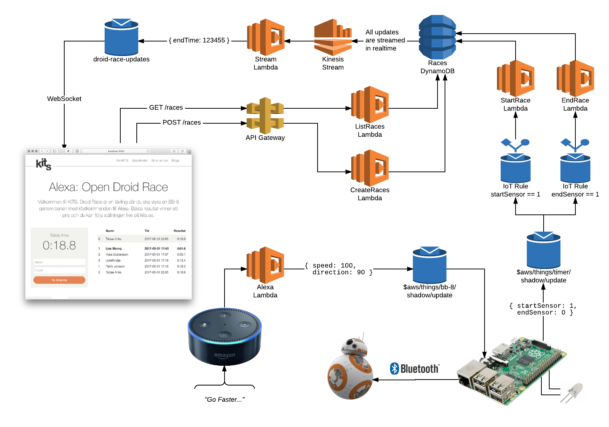

# Droid Race

Droid Race is an IoT application that was created to be used as a fun competition at conferences. The idea is that you should control a Sphero BB-8 with your voice using an Amazon Echo through a track. The race is tracked using IR-sensors connected to a Raspberry PI and the results are shown in real time in a React application. 

## Overview

The application is built on a serverless architecture and if you need an introduction you can checkout our [blog post](https://kits.se/blogg/2017/02/06/serverless-1/) on the topic. The image below shows you an overview of the architecture. 

 

## Running

There are many parts to getting the whole system up and running and you are probably more interested in the code. But if you want to get it up and running you can follow these steps: 

### The backend

The first thing you need to do is to deploy the backend to AWS. Our [blog post](https://kits.se/blogg/2017/02/06/serverless-1/) shows you how to get your account ready and when you've done that you should login to you account, go to **AWS IoT**, go to **Settings** and copy the endpoint address. Go to the file `backend/serverless.yml` and change the `IOT_ENDPOINT` to that address. Now you can deploy the backend:

> cd backend
> npm install
> serverless deploy

Notice the endpoint address, this will be used later.

### The frontend

The frontend is a normal React app but to run it you need you make sure it can connect to the backend. Create a new file in the root directory of this project called `.env`. It should look like this:

```
API_ENDPOINT=
IOT_ACCESS_KEY_ID=
IOT_ENDPOINT=
IOT_SECRET_ACCESS_KEY=
SPHERO_UUID=
```

The `IOT_ENDPOINT` is the same as you copied above and the `API_ENDPOINT` should be the endpoint address that was printed when you deployed the backend but remove `/races`.

For the `IOT_ACCESS_KEY_ID` and `IOT_SECRET_ACCESS_KEY` you can use your own keys that you created when you configured Serverless but you can also create a separate IAM user and give it a policy that looks like this.

```javascript
{
   "Version": "2012-10-17",
   "Statement": [
      {
         "Effect": "Allow",
         "Action": "iot:Connect",
         "Resource": "*"
      },
      {
         "Effect": "Allow",
         "Action": "iot:Receive",
         "Resource": "arn:aws:iot:eu-west-1:<YOUR_ACCOUNT_NUMBER>:topic/droid-race-updates"
      },
      {
         "Effect": "Allow",
         "Action": "iot:Subscribe",
         "Resource": "arn:aws:iot:eu-west-1:<YOUR_ACCOUNT_NUMBER>:topicfilter/droid-race-updates"
      }
   ]
}
```

When you've added the values to the `.env` file (you can ignore `SPHERO_UUID` for now) you are ready to start the frontend: 

> cd frontend
> npm install
> npm start

### The timer sensors

The [timer sensors](https://shop.pimoroni.com/products/ir-break-beam-sensor-5mm-leds) are connected to a Raspberry PI. The signal cable of the start sensor is attached to pin 5 and the end sensor to pin 6. Connect the red and black cables to 5V and ground. 

There are also two LEDs connected to indicate the state. Connect a green start LED from pin 14 through a 330Ω resistor to ground and do the same for the red stop LED but use the 15.

The timer is connected to AWS IoT as a thing. So go to AWS IoT and create a thing called **timer**. Follow the guide to create a certificate. Download the certificate to `.cert/timer/cert.pem`, the private key to `.cert/timer/private.key` and the root certificate to `.cert/root.crt`. Finally you need to attach a policy that looks something like this:

```javascript
{
   "Version": "2012-10-17",
   "Statement": [
      {
         "Effect": "Allow",
         "Action": "iot:Connect",
         "Resource": "arn:aws:iot:eu-west-1:<YOUR_ACCOUNT_NUMBER>:client/${iot:ClientId}"
      },
      {
         "Effect": "Allow",
         "Action": "iot:Subscribe",
         "Resource": "arn:aws:iot:eu-west-1:<YOUR_ACCOUNT_NUMBER>:topicfilter/$aws/things/${iot:ClientId}/*"
      },
      {
         "Effect": "Allow",
         "Action": [
           "iot:Receive",
           "iot:Publish"
         ],
         "Resource": "arn:aws:iot:eu-west-1:<YOUR_ACCOUNT_NUMBER>:topic/$aws/things/${iot:ClientId}/*"
      }
   ]
}
```

Now you are ready to start the timer:

> cd timer
> npm install
> npm start

### Sphero

Now it's finally time to get the Sphero BB-8 running. It's the same story here, create a thing in AWS IoT, call it **bb-8**, download the certificate to `.cert/bb-8/cert.pem`, the private key to `.cert/bb-8/private.key` and attach a policy. You can use the same policy if you want.

Try to start it:

> cd sphero
> npm install
> npm start

You should see a message saying that it connected to MQTT but it will fail to communicate with the BB-8 itself. To fix this you need to find the UUID of the BB-8 and update the `.env` file with this information. Run `npm run discover`, this will try to find all Bluetooth devices and hopefully you will find your BB-8 in the list. Copy the UUID to the `.env` file and run `npm start` again. It should now connect to both MQTT and SPHERO.

You can control it with you keyboard using up, down, left, right and space bar for stop.

### Alexa

The final step is Amazon Echo. Log in to [developer.amazon.com](https://developer.amazon.com) and create an account. Create a new skill using Alexa Skills Kit, call it "Droid Race" and copy the content of the file `alexa/skill.json` as the interaction model.

Configure the endpoint by choosing AWS Lambda ARN and choose Europe as the region. To get the actual ARN you go back to the backend folder and run `serverless info --verbose`. Copy the value for `AlexaLambdaFunctionQualifiedArn` but remove the ending `:nn` which is the version and you don't need it.

Enable the skill and try the following sequence:

> alexa
> open droid race
> forward
> left
> hard left
> right
> hard right
> faster
> slower
> hyperspeed
> stop
> bye

Hopefully it worked, otherwise it's time to checkout the code.

## License
Copyright 2017 KITS AB

Licensed under the Apache License, Version 2.0 (the "License"); you may not use this work except in compliance with the License. You may obtain a copy of the License in the LICENSE file, or at:

<http://www.apache.org/licenses/LICENSE-2.0>

Unless required by applicable law or agreed to in writing, software distributed under the License is distributed on an "AS IS" BASIS, WITHOUT WARRANTIES OR CONDITIONS OF ANY KIND, either express or implied. See the License for the specific language governing permissions and limitations under the License.
